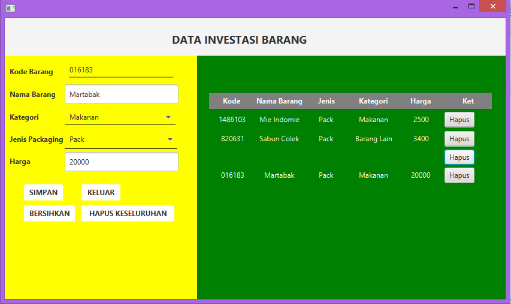

# Kuis2

## Ini adalah tampilan awal dimana saya menyimpan beberapa barang dan menampilkannya di tabel
##

## Ketika saya menghapus salah satu baris tabel, maka data yang ada di baris tersebut juga terhapus. Ini adalah fungsi button hapus yang ada di setiap baris tabel
##

## Ketika saya memencet tombol bersihkan, maka semua data yang ada di field sebelah kiri akan terhapus semua
##

## Ketika saya memencet tombol hapus keseluruhan, maka seluruh data yang ada di tabel akan terhapus
